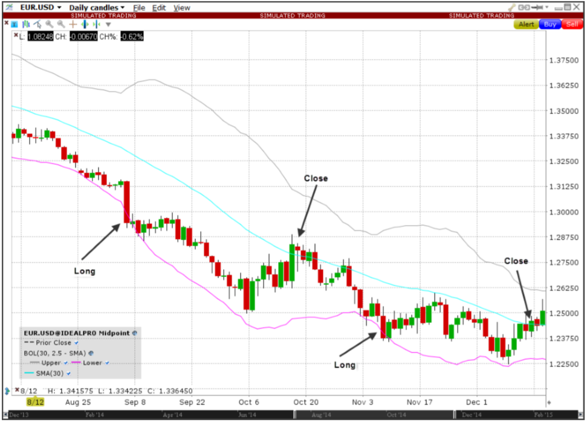

 

 

 

 

# BreakOut Strategy

## Functionality

The strategy goes long when close price crosses below BB and exits when crosses above MA,
and vice versa goes short when close price crosses above BB and exits when crosses below MA.

## Technology

### Language

The code is based on Java 8 and leverages Reactor framework for running and testing the strategy.

## Quality

### Code

Code quality is measured automatically by two analyzers and targets zero issues.

### Test

Code coverage by tests is measured automatically by two analyzers and targets >=95%.

### Security

Library quality is measured automatically by one analyzer and targets zero issues.